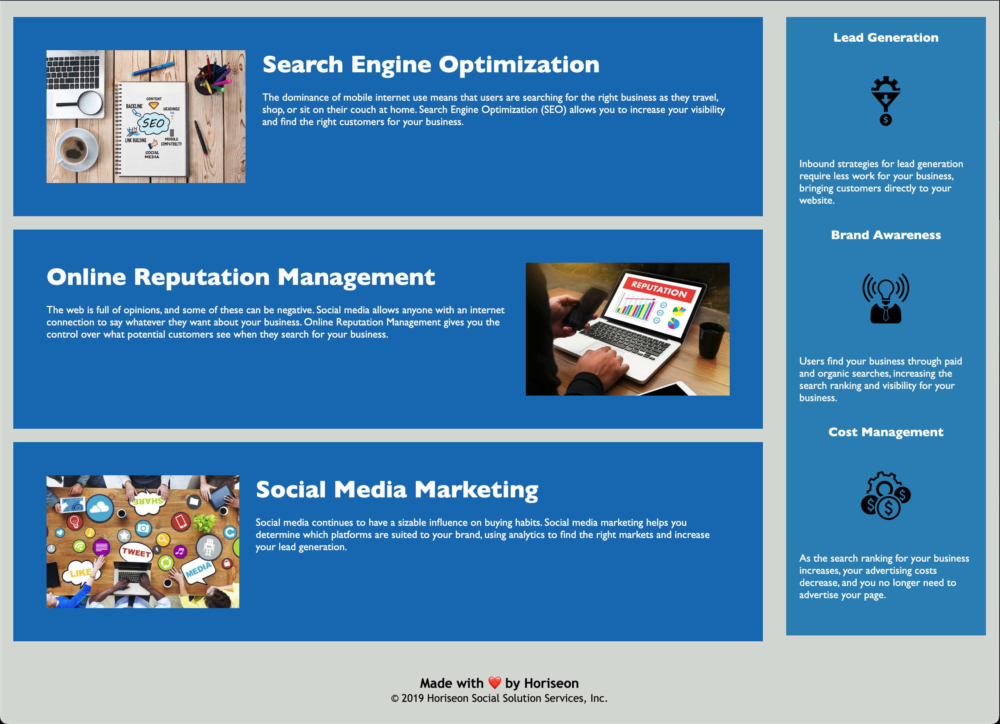

# challenge-1
Weekly challenge module 1

## Description

User Story: AS a marketing agency I WANT to refactor code and implement accessibility SO THAT  
people with disablities can have equal access to the website and it is optimized for search 
engines.

Using received website containing HTML and CSS I refactored the code and increased it's accessibility  
through the implementation of semantic elements, structuring HTML in logical and sequential order,  
adding descriptive title as well as improving CSS by consolidating repetitions and organizing the code.  
Implemented changes was provided with appropriate comments in the whole code.

## Usage

Website <a href="https://martamilewczyk.github.io/challenge-1/">hosted</a> on Github Pages

  

## Credits

<li><a href="https://github.com/">Github</a></li>

<li><a href="https://code.visualstudio.com/">VS Code</a></li>

<li>Bootcamp tutorial - lack of possibility to share link as it is private asset of Company</li> 

## License

MIT license

